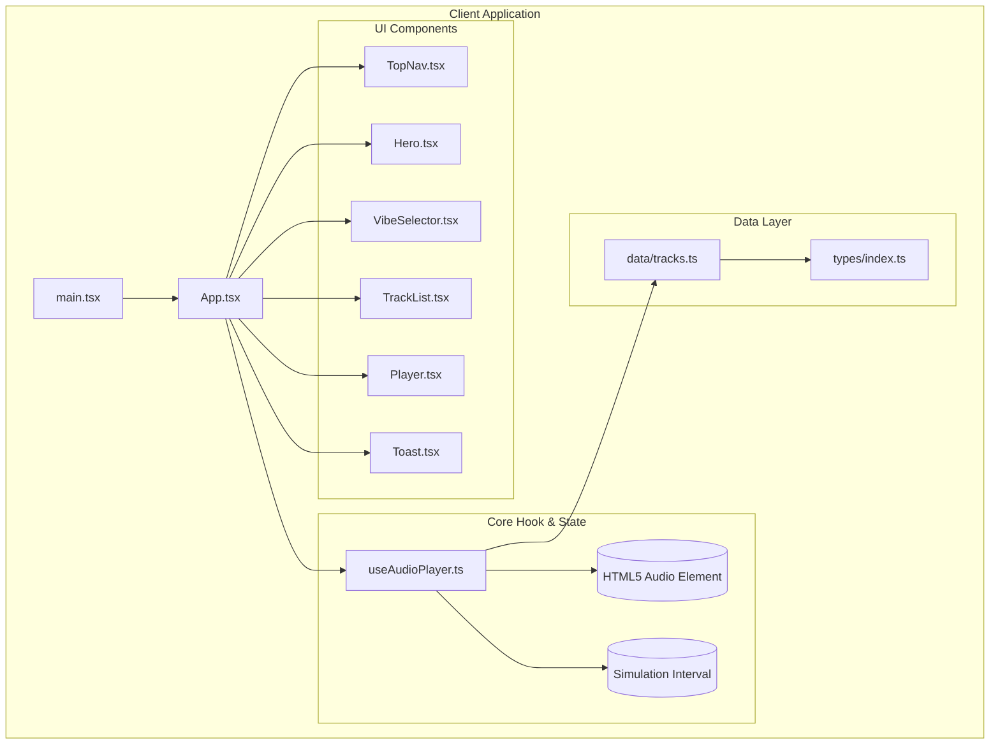
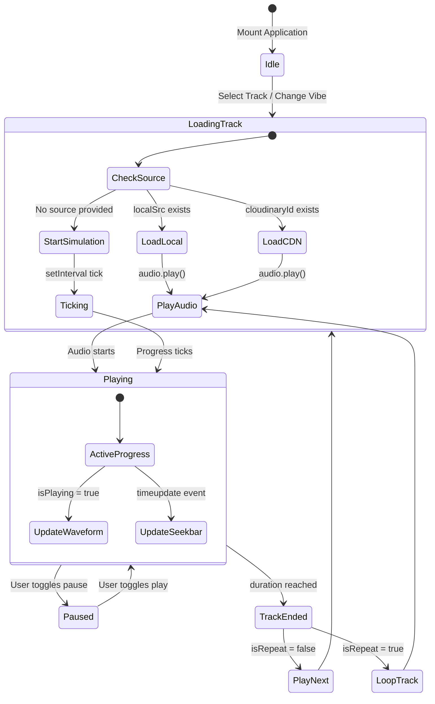
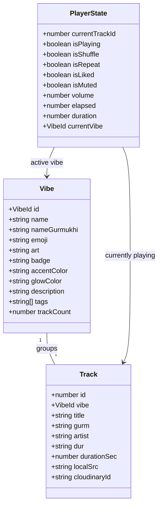

# 🎼 Mehfil (Punjabi Gabru Beats) — Developer & Architecture Guide

This document defines the architectural patterns, state flow, data contracts, and developer workflows for the **Mehfil / Punjabi Gabru Beats** web application.

---

## 🏛️ System Architecture



---

## 🎛️ State Machine & Audio Lifecycle



---

## 📐 Data Contracts (`src/types/index.ts`)



---

## 🛠️ Development Guidelines

### 1. Audio Source Priority
When configuring tracks in `src/data/tracks.ts`:
1. `localSrc`: Files placed in `public/songs/` (e.g. `'295_bass_remix.mp3'`). Highest priority.
2. `cloudinaryId`: Cloudinary public IDs (e.g. `'punjabi/295_remix'`). Secondary fallback.
3. If neither is present, the built-in second-timer simulation executes automatically to maintain visual progress without console crashes.

### 2. Styling Standards
- Use **CSS Modules** (`*.module.css`) for all component styling.
- Design tokens reside in `src/styles/globals.css`:
  - Backgrounds: `--col-bg (#0a0a0f)`, `--col-surface (#13131f)`
  - Accents: `--col-neon-orange (#ff6b00)`, `--col-neon-amber (#ffae00)`, `--col-neon-pink (#ff3fa4)`, `--col-neon-purple (#9b59ff)`
  - Fonts: `--font-main ('Outfit')`, `--font-head ('Rajdhani')`

### 3. Font System
- Fonts are bundled offline via `@fontsource/outfit` and `@fontsource/rajdhani`.
- Avoid external CDN links to prevent connection drops in constrained environments.

---

## 📋 Common Commands

```bash
# Start Vite development server
npm run dev

# Run TypeScript type check
npx tsc --noEmit

# Create optimized production build
npm run build

# Preview production build locally
npm run preview
```
