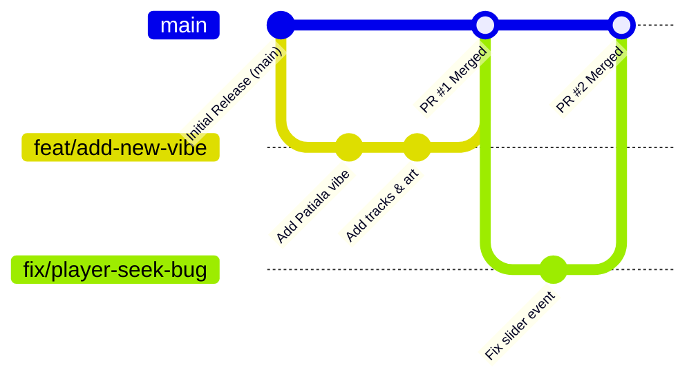

# 🤝 Contributing to Mehfil (Punjabi Gabru Beats)

Thank you for your interest in contributing to **Mehfil**! Whether you want to add new Punjabi vibes, submit remixes, improve the player UI, or fix bugs, your contributions are warmly welcomed.

---

## 🌿 Branching Strategy & Workflow

We follow standard GitHub Flow with feature branches.



---

## 📋 Step-by-Step Contribution Guide

### 1. Fork & Clone the Repository

1. Click the **Fork** button at the top-right of [github.com/animeshtripathii/Mehfil](https://github.com/animeshtripathii/Mehfil).
2. Clone your fork locally:
   ```bash
   git clone https://github.com/<YOUR-USERNAME>/Mehfil.git
   cd Mehfil
   ```

3. Set up the upstream remote:
   ```bash
   git remote add upstream https://github.com/animeshtripathii/Mehfil.git
   ```

---

### 2. Create a Topic Branch

Always create a new branch from `main` with a descriptive prefix:

| Prefix | Description | Example |
|---|---|---|
| `feat/` | New features or new vibes/tracks | `git checkout -b feat/lofi-geri-vibe` |
| `fix/` | Bug fixes | `git checkout -b fix/audio-seek-lag` |
| `style/` | UI/UX visual improvements | `git checkout -b style/neon-visualizer` |
| `perf/` | Performance optimizations | `git checkout -b perf/asset-compression` |
| `docs/` | Documentation improvements | `git checkout -b docs/update-readme` |

```bash
git checkout -b feat/your-feature-name
```

---

### 3. Install Dependencies & Develop

```bash
# Install packages
npm install

# Start development server
npm run dev
```

Visit `http://localhost:5173` to test your changes live with Hot Module Replacement (HMR).

---

### 4. Adding New Tracks or Vibes

When adding new content:

1. **Artwork**: Place images (`.jpeg` / `.jpg` / `.png`) in `public/assets/`.
2. **Songs**:
   - For local tracks, place `.mp3` files in `public/songs/`.
   - Update [`src/data/tracks.ts`](src/data/tracks.ts):
     ```typescript
     {
       id: 15,
       vibe: 0, // VibeId
       title: 'Your Song Title',
       gurm: 'ਗੀਤ ਦਾ ਨਾਮ',
       artist: 'Artist Name',
       dur: '3:45',
       durationSec: 225,
       localSrc: 'your_song.mp3',
       cloudinaryId: '',
     }
     ```
3. If creating a new vibe, add it to the `VIBES` array in [`src/data/tracks.ts`](src/data/tracks.ts) and ensure `VibeId` in [`src/types/index.ts`](src/types/index.ts) is updated if necessary.

---

### 5. Quality & Type Checks

Before committing, verify that there are no TypeScript or build issues:

```bash
# Run TypeScript type check
npx tsc --noEmit

# Test production build
npm run build
```

---

### 6. Commit & Push

Write clear, concise commit messages following conventional commits:

```bash
# Stage changes
git add .

# Commit with a meaningful message
git commit -m "feat(player): add volume slider tooltip and mute toggle animation"

# Push to your fork
git push origin feat/your-feature-name
```

---

### 7. Open a Pull Request (PR)

1. Navigate to your fork on GitHub.
2. Click **Compare & pull request**.
3. Fill out the PR template with:
   - What changed and why.
   - Screenshots / Screen recordings (if UI changes were made).
   - Any testing steps performed.
4. Submit the PR for review!

---

## 🎨 Code Style Guidelines

- **TypeScript**: Strict type annotations; avoid `any`.
- **CSS**: Use **CSS Modules** (`*.module.css`) for all components. Keep design tokens aligned with variables in `src/styles/globals.css`.
- **Fonts**: Do not introduce external Google Fonts CDN tags. Always use `@fontsource` packages to maintain 100% offline capability.
- **Audio Integrity**: Always provide safe fallbacks in `useAudioPlayer` for tracks that may not yet have audio files uploaded.

---

## 💬 Questions or Suggestions?

Feel free to open an **Issue** or start a **Discussion** on GitHub!

**ਬਾਬਾ ਸੁੱਖ ਰੱਖੇ • Happy Coding!** 🚜💨
