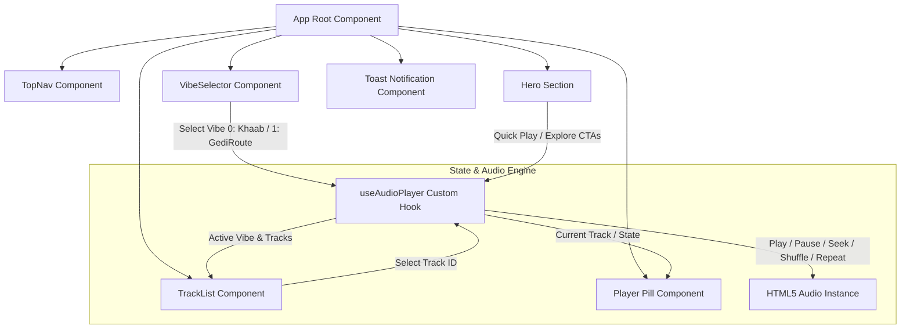
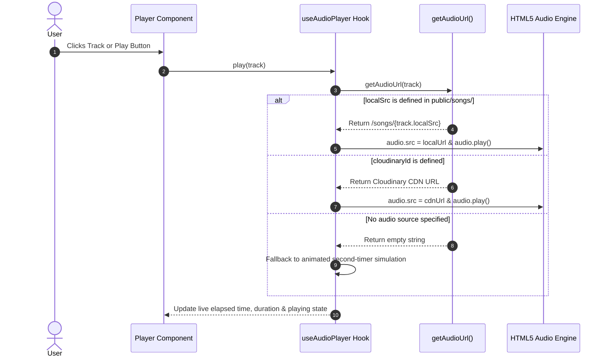

#Mehfil 🎵

> **"ਬਾਬਾ ਸੁੱਖ ਰੱਖੇ • Hustle Hard, Play Harder"**  
> A high-energy, vibrant Punjabi music streaming dashboard featuring highway bass remixes, pendu dhol anthems, and late-night soulful lofi vibes.

---

## ✨ Features

- 🎛 **Dynamic Vibe Curation**:
  - **❤️ Khaab**: Soulful romantic tracks, starry night melodies, and lofi reverbs (*Akhil, AP Dhillon, Babbu Maan*).
  - **🏍️ GediRoute**: Highway bass bangers, bullet bike beats, and high-energy anthems (*Sidhu Moosewala, Karan Aujla, Diljit Dosanjh*).
- 💊 **Compact Glassmorphism Pill Player**:
  - Inspired by modern sleek audio controls.
  - Features real-time track artwork, spinning neon visualizer ring, title/artist marquee, playback controls, and interactive seek bar.
- ⚡ **Zero-Latency Local & Cloud Streaming**:
  - **Local MP3 Support**: Drop songs in `public/songs/` for instant offline and static playback on Render/Vercel.
  - **Cloudinary CDN Integration**: Direct streaming fallback for cloud-hosted audio files.
  - **Realistic Playback Simulation**: Built-in fallback timer engine ensures smooth UI feedback even prior to audio asset binding.
- 🎨 **Highway Neon & Cultural Aesthetic**:
  - Deep midnight dashboard (`#0a0a0f`) with vivid neon amber, orange, pink, and purple glows.
  - Handcrafted cultural typography powered by `@fontsource/outfit` and `@fontsource/rajdhani` (100% offline & local).
- ⌨️ **Keyboard Controls**:
  - `Space`: Play / Pause toggle
  - `Alt + Right Arrow`: Next Track
  - `Alt + Left Arrow`: Previous Track

---

## 🏗️ Architecture & Component Flow



---

## 🔄 Audio Source Resolution Flow



---

## 📁 Project Structure

```
├── public/
│   ├── assets/              # High-res thematic artwork (Khaab.jpeg, home_page.jpeg, etc.)
│   └── songs/               # Drop your .mp3 tracks here
├── src/
│   ├── components/
│   │   ├── Hero/            # Punjabi highway hero header with CTAs & stats
│   │   ├── Player/          # Glassmorphism compact audio player pill
│   │   ├── Toast/           # Real-time interactive toast alerts
│   │   ├── TopNav/          # Floating top navigation bar with live status
│   │   ├── TrackList/       # Animated playlist with live audio wave bars
│   │   └── VibeSelector/    # Interactive dual card selector (Khaab & GediRoute)
│   ├── data/
│   │   └── tracks.ts        # Track catalog, vibe definitions & audio URL resolver
│   ├── hooks/
│   │   └── useAudioPlayer.ts# React audio hook with controls, shortcuts & fallbacks
│   ├── styles/
│   │   └── globals.css      # Design tokens, reset, and keyframe animations
│   ├── types/
│   │   └── index.ts         # TypeScript models for Track, Vibe, and PlayerState
│   ├── App.tsx              # Root application component
│   └── main.tsx             # Application entry point with offline fontsource imports
├── package.json
├── tsconfig.json
├── vite.config.ts
└── README.md
```

---

## 🚀 Getting Started

### 1. Prerequisites
- **Node.js** (v18 or higher recommended)
- **npm** or **yarn** / **pnpm**

### 2. Installation

```bash
# Clone the repository
git clone https://github.com/animeshtripathii/Mehfil.git
cd Mehfil

# Install dependencies
npm install
```

### 3. Run Development Server

```bash
npm run dev
```
Open **[http://localhost:5173](http://localhost:5173)** in your browser.

### 4. Build for Production

```bash
npm run build
```

---

## 🎵 How to Add Your Own Songs

### Option A: Local MP3 Files (Recommended for Render)
1. Drop your `.mp3` file into `public/songs/` (e.g. `public/songs/khaab_remix.mp3`).
2. Open [`src/data/tracks.ts`](src/data/tracks.ts) and set `localSrc`:
```typescript
{
  id: 0,
  vibe: 0,
  title: 'Khaab (Acoustic Remix)',
  gurm: 'ਖ਼ਾਬ',
  artist: 'Akhil',
  dur: '3:58',
  durationSec: 238,
  localSrc: 'khaab_remix.mp3', // <-- Your filename in public/songs/
  cloudinaryId: '',
}
```

### Option B: Cloudinary CDN
1. Upload your audio file to your Cloudinary account.
2. In [`src/data/tracks.ts`](src/data/tracks.ts), set your cloud name:
```typescript
export const CLOUDINARY_CLOUD_NAME = 'your-cloud-name';
```
3. Add the `cloudinaryId` to the track entry:
```typescript
{
  title: '295 (Bass Remix)',
  cloudinaryId: 'punjabi-beats/295_bass_remix',
  // ...
}
```

---

## 🌐 Deploy to Render / Vercel

### Deploying to Render (Static Site)
1. Push this repository to GitHub.
2. Create a new **Static Site** on [Render.com](https://render.com).
3. Connect your repository `https://github.com/animeshtripathii/Mehfil`.
4. Configure build settings:
   - **Build Command**: `npm run build`
   - **Publish Directory**: `dist`
5. Click **Create Static Site** — all assets and local songs in `public/songs/` will be served globally with high speed.

---

## 📜 License
MIT License © 2026 Animesh Tripathi
